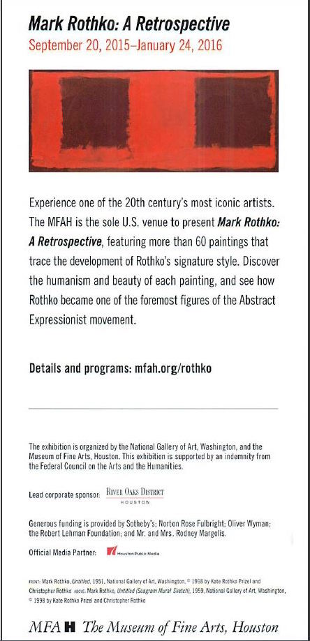

# HTML Basics - Recreate Flier into HTML

## Context
The Museum of Fine Arts Houston wants to build a static webpage to promote their Rothko exposition.  They currently have a flier designed by a graphic artist and they would like to design the site with a similar layout.

They have provided us with the copy as well as the images and logos, and we will need to place that content on the page
For now, we don't need to worry too much about styling; we just want to get the content on the page.

## The Assignment
Create the html for the flier shown below using appropriate `<h>`, `<p>`, ``, `<a>` and `<div>` tags.

All of your work and markup should be created in an `index.html` file inside of a folder called `assignment-01`, and make sure that you are using the HTML5 standard (with `<!DOCTYPE html>` declaration at the top of the file).

## Setup

You will need to follow setup and configuration instructions for all the assignments. The order of execution is important to starting correctly

In your Terminal application:

```sh
# 1 - Change directories into assignments
cd ~/muktek/assignments

# 2 - Change directories into assignments
mkdir assignment--basic-html-rothko

# 3 - Change directories into the `mkdir assignment--basic-html-rothko` directory you created
cd assignment--basic-html-rothko

# 4 - Create the `index.html` file
touch index.html

# 5 - open project files in Atom
atom .

# 6 - open `index.html` in browser
firefox index.html

```


### The flier


### The text copy
*This is the text from the copywriter that is currently on the flier.*

---

```
Mark Rothko

September 20, 2015–January 24, 2016

Experience one of the 20th century's most iconic artists. The MFAH is the sole U.S. venue to present Mark Rothko: A Retrospective, featuring more than 60 paintings that trace the development of Rothko's signature syle. Discover the humanism and beauty of each painting and see how Rothko became one of the foremost figures of the Abstract Expressionist movement.

Details and Programs: mfah.org/rothko

The exhibition is organized by the National Gallery of Art, Washington and the Museum of Fine Arts, Houston. This exhibition is supported by an indemnity from the Federal Council on the Arts and the Humanities

Lead corporate sponsor: «River Oaks District Logo»

Generous funding is provided by Sotheby's; Norton Rose Fulbright; Oliver Wyman; the Robert Lehman Foundation; and Mr and Mrs. Rodney Margolis.

Official Media Partner: «Houston Public Media logo»

Mark Rothko, Untitled (Seagram Mural Sketch), 1959. National Gallery of Art, Washington. Copyright 1998 by Kate Rothko Prizel and Christopher Rothko

«MFAH The Museum of Fine Arts Logo»
```

---

### Image links
```
Mural
-----
https://raw.githubusercontent.com/muktek/assignment--basic-html-rothko/master/assets/mark-rothko-seagram-mural.jpg

River Oaks District Logo
-----
https://raw.githubusercontent.com/muktek/assignment--basic-html-rothko/master/assets/river-oaks-district-img.png

Houston Public Media Logo
-----
https://raw.githubusercontent.com/muktek/assignment--basic-html-rothko/master/assets/houston-public-media-logo.jpg

MFAH Logo
-----
https://raw.githubusercontent.com/muktek/assignment--basic-html-rothko/master/assets/mfah-logo-sm.png

```
